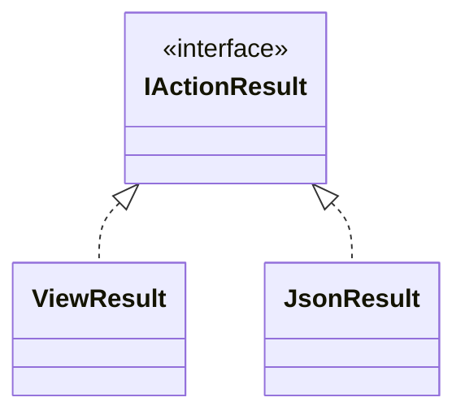

# Benefits and Features

### Cross Platform
ASP.NET Core applications can be developed and run across different platforms like:

1. Windows
2. MacOS
3. Linux

ASP.NET Core applications can be hosted on
1. IIS
2. Apache
3. Docker
4. Self-host in your own process

ASP.NET Core has Unified Programming Model for MVC and Web API. In both cases the *Controller* we create inherits *ControllerBase* class and return *IActionResult*

| | | |
|-|-|-|
|| |  |
| | | |
