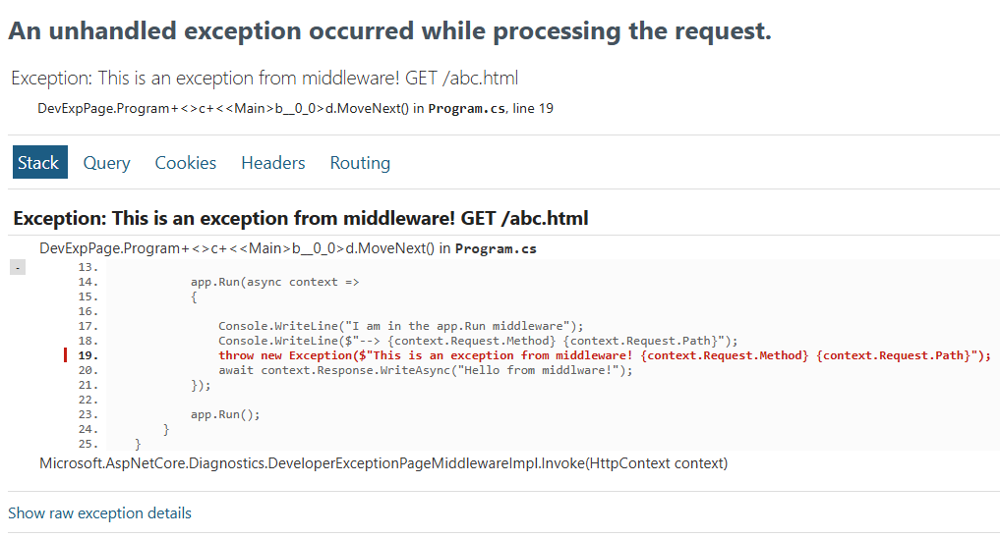

# Development Exception Page

When exception occurs on server and we are in development environment, it is best to get the error in the browser. For this we have the *DeveloperExecptionPage* middleware.

In earlier styles, prior **minimal hosting**, (which means *WebApplication.CreateBuilder*), The writing style was **generic host + Startup** (or **ConfigureWebHostDefualts**). In this style we had to register the *DeveloperExecptionPage* middlware in the *Statup.Configure* method:
```c#
public class Program
{
    public static void Main(string[] args) =>
        Host.CreateDefaultBuilder(args)
            .ConfigureWebHostDefaults(web =>
            {
                web.UseStartup<Startup>();
            })
            .Build()
            .Run();
}

public class Startup
{
    public void Configure(IApplicationBuilder app, IWebHostEnvironment env)
    {
        if (env.IsDevelopment())
        {
            app.UseDeveloperExceptionPage(); // only if YOU add this
        }
        app.UseRouting();
        app.UseEndpoints(endpoints =>
        {
            endpoints.MapGet("/", () => "Hello");
        });
    }
}
```
In the newer **minimal hosting** style ASP.NET Core has [automatically registered UseDeveloperExceptionPage()](https://github.com/dotnet/aspnetcore/pull/34616) at the start of the pipeline when the environment is Development, so we don't need to register it to the pipeline by ourselfes. It is already there.

Assuem the following code, where *UseDeveloperExceptionPage* middlware is already in the pipeline, we throw an exeption from the custom middlware:
```c#
public static void Main(string[] args)
{
    var builder = WebApplication.CreateBuilder(args);
    var app = builder.Build();

    app.UseFileServer();

    app.Run(async context =>
    {
        throw new Exception("This is an exception from middleware!");
        await context.Response.WriteAsync("Hello from middlware!");
    });

    app.Run();
}
```
since we have an *index.html* file in our static files root folder, the *UseFileServer* middleware handles it and **short-circuits**, so the exception won't appear. 

If we requeset a file that doesn't exist in the static files root folder, for example *favicom.ico* that the browser request, since this file doesn't exist, we get into the second middleware that throws an exception, and we get the exception page.
 
***UseDeveloperExceptionPage*** must be plugged-in to the request process pipeline as early as possible, in order to handle the exception and display the exception page.



This page contains exception detais like:
- Stack trace including the file name and line number that caused the exception
- Query String, Cookies, HTTP headers and Routing

Like most other middleware components in ASP.NET Core, we can also customize *UseDeveloperExceptionPage* middleware. Whenever you want to customize a middleware component, always remember you may have the respective OPTIONS object. So, to Customize UseDeveloperExceptionPage middleware, use DeveloperExceptionPageOptions.

In the old style **generic host + Startup**, when we register the middlware by ourselfs we use:
```c#
if (env.IsDevelopment())
{
    app.UseDeveloperExceptionPage(new DeveloperExceptionPageOptions
    {
        SourceCodeLineCount = 10,
    }); 
}
```
With minimal hosting, WebApplication can inject UseDeveloperExceptionPage() for you, but that middleware still uses IOptions<DeveloperExceptionPageOptions> under the hood. So you configure it the same way as most other options: before builder.Build().
```c#
var builder = WebApplication.CreateBuilder(args);
builder.Services.Configure<DeveloperExceptionPageOptions>(options =>
{
    options.SourceCodeLineCount = 10; // example: lines of source around the error
    // other properties as needed
});
var app = builder.Build();
// ... rest of pipeline
```

*SourceCodeLineCount* property specifies how many lines of code to include before and after the line of code that caused the exception.

**Bibliography:** 

1. [ASP NET Core developer exception page](https://www.youtube.com/watch?v=UGG2-oV9iQ8&list=PL6n9fhu94yhVkdrusLaQsfERmL_Jh4XmU&index=14)

    [


| | | |
|-|-|-|
[](../../README.md) | [](./static_files_11.md) | [](../../README.md) |
| | | 