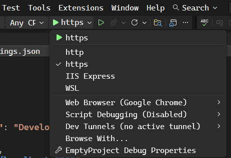

# launchsettings.json

We can change which profile to use by clicking on the relevant dropdownlist in Visual Studio

The value in the dropdown are those of the commandName property in the ***launchsettings.json*** file:

- http
- https
- IISExpress
- WSL

As can be read [***Here***](https://learn.microsoft.com/en-us/aspnet/core/fundamentals/environments?view=aspnetcore-10.0#set-the-environment-with-the-launch-settings-file-launchsettingsjson), we can also set envitonmnet variable in the **launchsettings.json** file. In the preevious exmaple, [*here*](./launchsettings_08.md), we set the ***ASPNETCORE_ENVIRONMENT*** environment varialbe to *Develop*. Environment values set in **launchSettings.json** override values set by the system environment.
